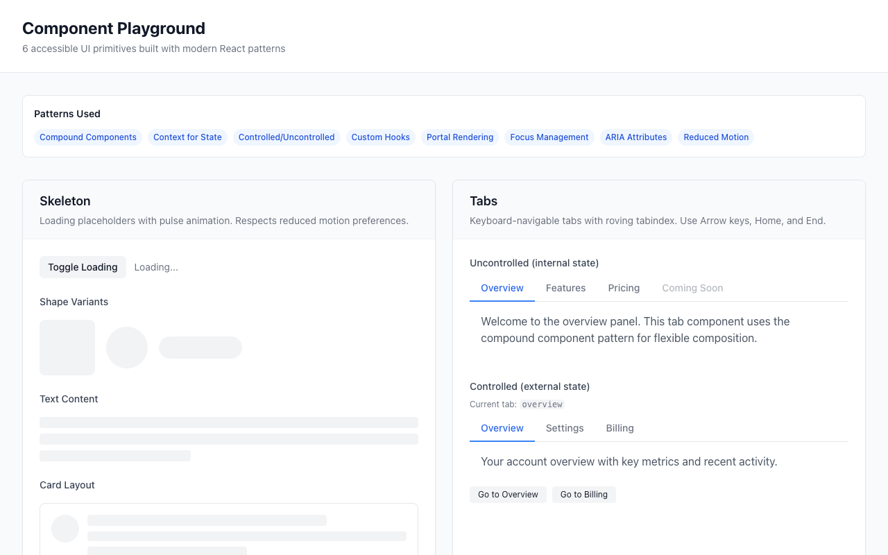
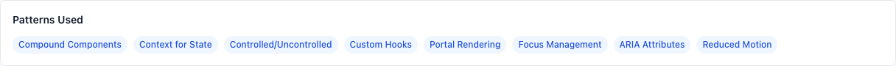
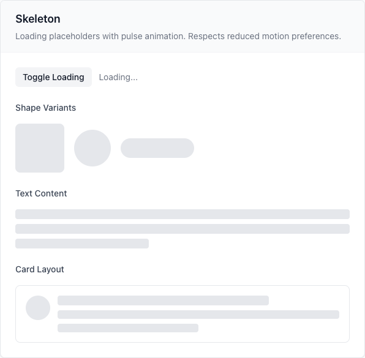
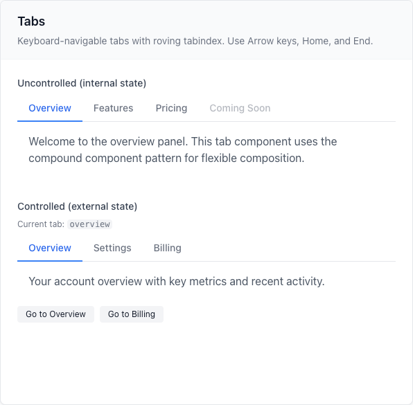
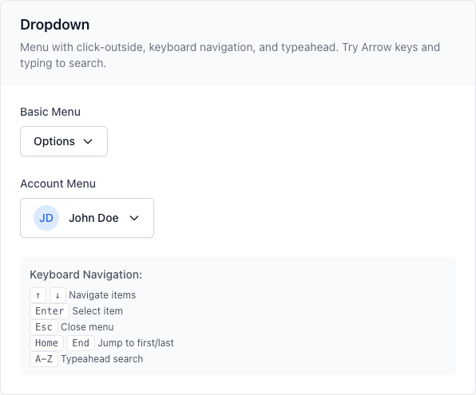
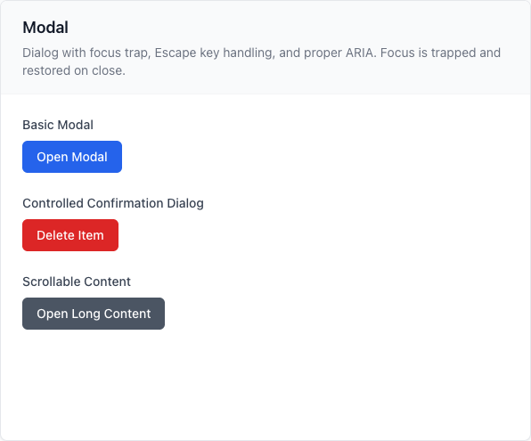
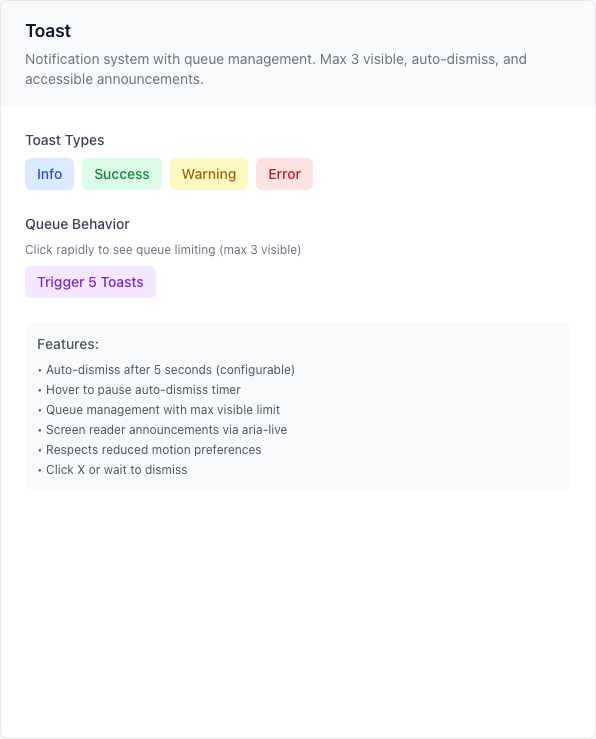
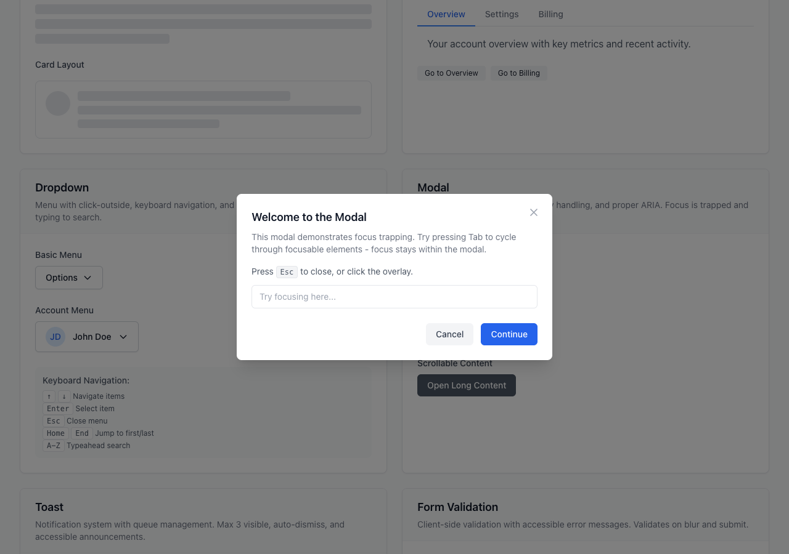
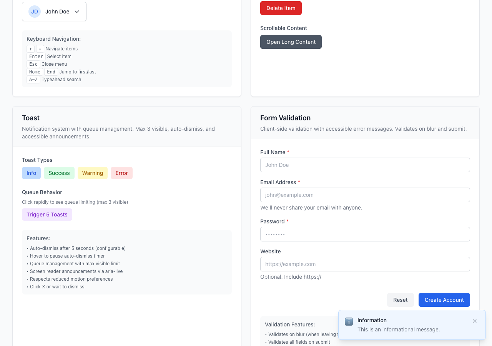

# Component Playground

A hands-on playground for practicing modern React composition and accessibility patterns by building 6 reusable UI primitives from scratch.

**[🚀 Live Demo](https://component-playground-xi.vercel.app)**



## Goal

Build production-quality, accessible UI components without reaching for external libraries—understanding the patterns deeply enough to implement them yourself.

## What I Built

### 6 UI Primitives

| Component | Pattern | Key Features |
|-----------|---------|--------------|
| **Skeleton** | Presentational | Pulse animation, shape variants (text, circle, card), reduced motion support |
| **Tabs** | Compound Component | Roving tabindex, arrow/Home/End navigation, controlled & uncontrolled modes |
| **Dropdown** | Compound Component | Click-outside, typeahead search, full keyboard navigation |
| **Modal** | Compound + Portal | Focus trap, body scroll lock, Escape to close, aria-modal |
| **Toast** | Context + Queue | Auto-dismiss, hover pause, max 3 visible, aria-live announcements |
| **Form** | Context + Validation | Blur + submit validation, aria-invalid, built-in validators |

### Component Demos

<table>
<tr>
<td width="50%">

**Skeleton Loader**



</td>
<td width="50%">

**Tabs**



</td>
</tr>
<tr>
<td width="50%">

**Dropdown Menu**



</td>
<td width="50%">

**Modal Dialog**



</td>
</tr>
<tr>
<td width="50%">

**Toast Notifications**



</td>
<td width="50%">

**Form Validation**



</td>
</tr>
</table>

**Modal with Focus Trap**



**Stacked Toast Notifications**



### 4 Custom Hooks

- `useClickOutside` — Detect clicks outside an element
- `useFocusTrap` — Trap focus within a container (essential for modals)
- `useControllable` — Support both controlled and uncontrolled patterns
- `useReducedMotion` — Respect `prefers-reduced-motion`

## What I Learned

### Compound Components Are Worth It
The pattern feels verbose at first, but it provides:
- Flexible composition without prop drilling
- Clear separation of concerns
- Intuitive API for consumers (`<Tabs.Tab>`, `<Modal.Content>`)

### Focus Management Is Hard
- Focus traps need to handle dynamic content (elements appearing/disappearing)
- Always restore focus to the trigger when closing overlays
- `tabindex="-1"` makes elements programmatically focusable without adding to tab order

### ARIA Is About Relationships
- `aria-controls` / `aria-labelledby` / `aria-describedby` connect elements semantically
- `aria-expanded` and `aria-selected` communicate state
- `role="alert"` and `aria-live` announce dynamic content

### Animation + Accessibility
- `prefers-reduced-motion` should disable or simplify animations
- CSS-only reduced motion (via media query in Tailwind) is the simplest approach
- Consider providing a JS hook (`useReducedMotion`) for dynamic animations

## How to Run

```bash
# Navigate to project
cd component-playground

# Install dependencies
npm install

# Start development server
npm run dev

# Open http://localhost:3000
```

## Stack

- **Next.js 14** — App Router
- **TypeScript** — Strict mode
- **Tailwind CSS** — Utility-first styling
- **clsx + tailwind-merge** — Conditional class merging (only external deps)

## Project Structure

```
component-playground/
├── app/
│   ├── layout.tsx        # Root layout
│   ├── page.tsx          # Playground with all demos
│   └── globals.css       # Tailwind + custom utilities
├── components/
│   ├── ui/               # The 6 UI primitives
│   │   ├── Skeleton.tsx
│   │   ├── Tabs.tsx
│   │   ├── Dropdown.tsx
│   │   ├── Modal.tsx
│   │   ├── Toast.tsx
│   │   └── Form.tsx
│   └── playground/       # Demo components
├── hooks/                # Custom hooks
│   ├── useClickOutside.ts
│   ├── useFocusTrap.ts
│   ├── useControllable.ts
│   └── useReducedMotion.ts
└── lib/
    └── cn.ts             # Class merge utility
```

## Accessibility Checklist

- [x] All interactive elements keyboard accessible
- [x] Focus visible indicators
- [x] Focus trapping in modal
- [x] Escape key closes overlays
- [x] ARIA attributes (roles, states, properties)
- [x] Screen reader announcements for toasts
- [x] Reduced motion support
- [x] Form validation announced to screen readers

---

Part of [frontend-field-notes](https://github.com/hexiao0225/frontend-field-notes) — frontend experiments and learning projects.
